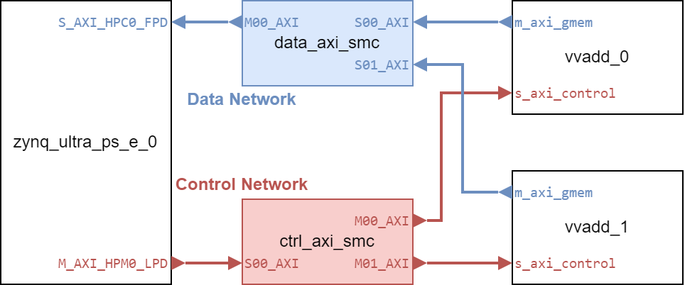

# AXI4-MM 101: A Brief Introduction to the AXI4 Memory-Mapped Interface

## Overview
This tutorial briefly introduces the AXI4 memory-mapped interface, which is used in hardware accelerators for communication between the programmable logic (PL) and the ARM processor on the Ultra96-V2 board. It also provides two hands-on examples to build AXI4-MM systems using Vivado block design.

## Pre-requisites
A Linux machine with:
- Vitis HLS 2023.2
- Vivado 2023.2
- Access to a PYNQ Ultra96-V2 board

## 1. What is AXI4 Memory-Mapped Interface?
AXI4 (Advanced eXtensible Interface version 4) is part of ARM’s AMBA 4 standard. It includes two main flavors:
- **Memory-Mapped Interfaces**: includes AXI4-Full and AXI4-Lite, access data according to addresses. **It will be the topic of this tutorial.**
- **Stream Interfaces**: includes AXI4-Stream, used for streaming data transfer without address mapping.

AXI4 memory-mapped interfaces (AXI4-MM) are used to connect the programmable logic (PL) with the ARM processor (named processing system, PS) on the Ultra96-V2 board. They allow the PL to read and write data from/to the shared memory, and the PS to read/write PL registers for control and status.

Building a highly optimized AXI-MM system is a complex task and far exceeds the scope of this tutorial. Here, we will only focus building a functional AXI4-MM system. AXI4-MM is a point-to-point, synchronous protocol, which means you can only connect **master-slave paris** driven by the **same clock**. The one sending the address and instructions is called the **master**, and the one responding to the instructions is called the **slave**.

> Although in ARM's terms, the master is called the **manager** and the slave is called the **subordinate**, master/slave is still more widely used in practice.

<details>
<summary> Quiz </summary>
Which one of the following is a valid AXI4-MM connection?
<div align="center">

</div>
<details>
<summary> Answer </summary>
A <br>
B connects a master and a slave from different clocks. C connects two masters. D connects one master to two slaves.
</details>
</details>

AXI4-MM adpots a decoupled address/data protocol --- the address and data can be transferred at different times. It is done by implementing five valid-ready handshake **channels**:
- **Read Address Channel (AR)**: the master sends the address of the data to be read on this channel.
- **Read Data Channel (R)**: the slave sends the data back to the master on this channel, along with a status code to indicate whether the read was successful.
- **Write Address Channel (AW)**: the master sends the address of the data to be written on this channel.
- **Write Data Channel (W)**: the master sends the data to be written on this channel.
- **Write Response Channel (B)**: the slave sends back a status code on this channel to indicate whether the write was successful.

We will not go into the details of how to operate these channels in this tutorial. Please refer to [(ARM Developer) Learn the architecture - An introduction to AMBA AXI: Channel transfers and transactions](https://developer.arm.com/documentation/102202/0300/Channel-transfers-and-transactions) for more information.

## 2. Connecting Multiple Masters and Slaves
Of course a realistic system will have multiple masters and slaves. AXI4-MM supports this by using **interconnect components**.
An interconnect component has both master and slave interfaces and coordinates the communication between multiple masters and slaves.
Masters and slaves will expose address spaces for the interconnect component to manage with an **address assignment**,
which is a function that outputs the slave address when fed with a master address.
A valid address assignment must ensure:
- Any master address is mapped to only one slave address (single-valued function).
- All mapped address segments are of equal size.
However, not all the addresses must be used; accessing unused addresses will return an error status code.

<details>
<summary> Quiz </summary>
Which one of the following is a valid AXI4-MM address assignment?
<div align="center">

</div>
<details>
<summary> Answer </summary>
A <br>
B maps one master segment to multiple slave segments.
</details>
</details>

## 3. Example of Multi-Master AXI4-MM System
Here we will reuse the vector add example from the [Quick Start tutorial](/quickstart/readme.md)
to create multiple instances of such kernel on the same Ultra96-V2 board.
We will also stick to the command-line flow for simplicity.

### 3.1 Generate the Verilog Code.
Follow the same steps as in the [Quick Start tutorial](/quickstart/readme.md) to generate the Verilog code for the vector add kernel.

### 3.2 Create a Vivado tcl Script
Now create a new tcl script `vivado.tcl` in the `src` directory.
```bash
cd src
touch vivado.tcl
```
A bare-minimum Vivado tcl script should finish the following steps:
1. Create a new project
2. Add source files and IP repositories
3. Create block designs
4. Make RTL wrappers for block designs
5. Setup synthesis and implementation runs
6. Launch the synthesis and implementation runs to get the bitstream

> If you are only working with RTL files and do not plan to use vendor-provided IP cores, you may skip the block design steps.

> We will skip most of the sanity checks and context management for simplicity. Refer to the Vivado-exported tcl script in the [Command Line Scripting tutorial](/command_line/readme.md) for more details.

#### 3.2.1 Create a new project

We use the `create_project` command to create a new project.
Let's write the following code to the `vivado.tcl` script:
```tcl
create_project multi_vvadd ./build_vivado -part xczu3eg-sbva484-1-i
```

<details>
<summary> <code>create_project</code> Syntax </summary>
<code>create_project $project_name $project_dir -part $part_number [-force]</code>
<list>
<li>
<code>$project_name</code> is the name of the project.
</li>
<li>
<code>$project_dir</code> is the directory to create the project in. Does not have to be the project name.
</li>
<li>
<code>$part_number</code> is the part number of the FPGA to target.
</li>
<li><code>-force</code> is an optional flag to overwrite the project if it already exists.</li>
</list>
</details>

#### 3.2.2 Add IP repositories

In this example, we only use HLS-generated and vendor-provided IP cores,
so we do not need to add RTL source files.

In Vivado, files and IP repos are managed by **filesets**.
It allows using the same project to run different designs under different constraints.
In our case, we will only use the `sources_1` fileset. Let's create it if it does not exist:
```tcl
if {[string equal [get_filesets -quiet sources_1] ""]} {
  create_fileset -srcset sources_1
}
```
> **tcl Syntax**: square brackets mean in-line command substitution. It uses the output of the command in the square brackets as the value of another command's argument:
>  - `string equal $A $B` returns true if `$A` and `$B` are the same string.
>  - `get_filesets -quiet sources_1` returns the fileset named `sources_1` if it exists, otherwise returns an empty string.
>  - Therefore, `string equal [get_filesets -quiet sources_1] ""` returns true if the `sources_1` fileset does not exist.

User IP repos are bookeeped by a property called `ip_repo_paths` of the `sources_1` fileset.
We use the `set_property` command to update this property.
```tcl
set_property ip_repo_paths "build_hls/solution1/impl/ip" [get_filesets sources_1]
update_ip_catalog -rebuild
```

<details>
<summary> <code>set_property</code> Syntax </summary>
<code>set_property $property_name $property_value $object</code>
<list>
<li>
<code>$property_name</code> is the name of the property to set.
</li>
<li>
<code>$property_value</code> is the value to set the property to.
</li>
<li>
<code>$object</code> is the object to set the property of.
</li>
</list>
</details>

#### 3.2.3 Create a block design

**3.2.3.1 Create major components**

In the Vivado-exported tcl, block design creation is wrapped in a procedure, which helps Vivado manage the context of multiple block designs. In our case, we will only create one block design, so we omit the procedure definition and directly create it:
```tcl
create_bd_design "multi_vvadd_bd"
```

Now we start to add things to the block design. This time we create two instances of the vector add kernel:
```tcl
create_bd_cell -type ip -vlnv xilinx.com:hls:vvadd:1.0 vvadd_0
create_bd_cell -type ip -vlnv xilinx.com:hls:vvadd:1.0 vvadd_1
```

The clock wizard:
```tcl
set clk_wiz_0 [create_bd_cell -type ip -vlnv xilinx.com:ip:clk_wiz:6.0 clk_wiz_0]
set_property CONFIG.CLKOUT1_REQUESTED_OUT_FREQ 200 $clk_wiz_0
set_property CONFIG.RESET_PORT {resetn} $clk_wiz_0
set_property CONFIG.RESET_TYPE {ACTIVE_LOW} $clk_wiz_0
```
> Note we assigned the output of the `create_bd_cell` command to a variable, which helps us to set properties of the created ip.

The Zynq Processor Core:
```tcl
set zynq_ultra_ps_e_0 [create_bd_cell -type ip -vlnv xilinx.com:ip:zynq_ultra_ps_e:3.5 zynq_ultra_ps_e_0]
set_property CONFIG.PSU__USE__S_AXI_GP0 1 $zynq_ultra_ps_e_0
set_property CONFIG.PSU__SAXIGP0__DATA_WIDTH 32 $zynq_ultra_ps_e_0
```

Two AXI Smart connects: one for control, the other for data. We will configure them later.
```tcl
set ctrl_axi_smc [create_bd_cell -type ip -vlnv xilinx.com:ip:smartconnect:1.0 ctrl_axi_smc]
set data_axi_smc [create_bd_cell -type ip -vlnv xilinx.com:ip:smartconnect:1.0 data_axi_smc]
```

> **How do I know which properties to set?**
>
> Usually you can find supported properties and their meanings in the IP's documentation:
> - Clock wizard: [LogiCORE IP Clocking Wizard v3.2 Data Sheet](https://docs.amd.com/v/u/en-US/clk_wiz_ds709)
> - Zynq Processor Core: [Zynq UltraScale+ MPSoC Processing System Product Guide: User Parameters](https://docs.amd.com/r/en-US/pg201-zynq-ultrascale-plus-processing-system/User-Parameters?tocId=wWbhUfXu5D6VgV8aSen9jQ)
> - AXI Smart Connect: [SmartConnect v1.0 LogiCORE IP Product Guide](https://docs.amd.com/r/en-US/pg247-smartconnect)
>
> You can also use the `report_property` command to list all properties of an block design cell, and look for the ones that appears relavent to your needs.

**3.2.3.2 Connect the AXI system**
Let's first configure the AXI Smart Connect IPs and make the connections to realize the following AXI system:
<div align="center">

</div>
The `data_axi_smc` has two slave ports and one master port, acting as a multiplexer to allow both vvadd instances to access the same memory. The `ctrl_axi_smc` has one slave port and two master ports, acting as a demultiplexer to allow the Zynq processor core to control both vvadd instances.

Write the following commands to the `vivado.tcl` script:
```tcl
set_property CONFIG.NUM_SI 2 $data_axi_smc
set_property CONFIG.NUM_MI 1 $data_axi_smc
set_property CONFIG.NUM_SI 1 $ctrl_axi_smc
set_property CONFIG.NUM_MI 2 $ctrl_axi_smc
```

To connect the wires, we use the `connect_bd_intf_net` command.
```tcl
# for the data AXI network
connect_bd_intf_net [get_bd_intf_pins vvadd_0/m_axi_gmem] [get_bd_intf_pins data_axi_smc/S00_AXI]
connect_bd_intf_net [get_bd_intf_pins vvadd_1/m_axi_gmem] [get_bd_intf_pins data_axi_smc/S01_AXI]
connect_bd_intf_net [get_bd_intf_pins data_axi_smc/M00_AXI] [get_bd_intf_pins zynq_ultra_ps_e_0/S_AXI_HPC0_FPD]

# for the control AXI network
connect_bd_intf_net [get_bd_intf_pins zynq_ultra_ps_e_0/M_AXI_HPM0_LPD] [get_bd_intf_pins ctrl_axi_smc/S00_AXI]
connect_bd_intf_net [get_bd_intf_pins ctrl_axi_smc/M00_AXI] [get_bd_intf_pins vvadd_0/s_axi_control]
connect_bd_intf_net [get_bd_intf_pins ctrl_axi_smc/M01_AXI] [get_bd_intf_pins vvadd_1/s_axi_control]
```

<details>
<summary> <code>connect_bd_intf_net</code> Syntax </summary>
<code>connect_bd_intf_net $intf_pin1 $intf_pin2</code>
<list>
<li>
<code>$intf_pin1</code> and <code>$intf_pin2</code> are the pins of the two interfaces to connect.
Pins of block design cells can be obtained with the <code>get_bd_intf_pins</code> command.
</li>
</list>
</details>

Then, we need to configure the correct address assignment to allow both vvadd instances to access the same memory, and the processor to address the control registers of them. The following figures illustrate our target address assignment:
<div align="center">

</div>

<div align="center">

</div>

We use the `assign_bd_address` command to assign the address:
```tcl
# for data network
assign_bd_address -offset 0x00000000 -range 2G -target_address_space [get_bd_addr_spaces vvadd_0/Data_m_axi_gmem] [get_bd_addr_segs zynq_ultra_ps_e_0/SAXIGP0/HPC0_DDR_LOW]
assign_bd_address -offset 0x00000000 -range 2G -target_address_space [get_bd_addr_spaces vvadd_1/Data_m_axi_gmem] [get_bd_addr_segs zynq_ultra_ps_e_0/SAXIGP0/HPC0_DDR_LOW]

# for control network
assign_bd_address -offset 0x80000000 -range 4K -target_address_space [get_bd_addr_spaces zynq_ultra_ps_e_0/Data] [get_bd_addr_segs vvadd_0/s_axi_control/Reg]
assign_bd_address -offset 0x80010000 -range 4K -target_address_space [get_bd_addr_spaces zynq_ultra_ps_e_0/Data] [get_bd_addr_segs vvadd_1/s_axi_control/Reg]
```

<details>
<summary> <code>assign_bd_address</code> Syntax </summary>
<code>assign_bd_address -offset $offset -range $range -target_address_space $master_address_space $slave_address_space</code>
<list>
<li>
<code>$offset</code> is the base address of the address space to assign.
</li>
<li>
<code>$range</code> is the size of the address space to assign in bytes. Can use human-readable units like "2G", "4K", etc.
</li>
<li>
<code>$master_address_space</code> is the address space of the master. Can be obtained by the <code>get_bd_addr_spaces</code> command.
</li>
<li>
<code>$slave_address_space</code> is the address space of the slave. Can be obtained by the <code>get_bd_addr_segs</code> command.
</li>
</list>
</details>

> **How do I know the fancy names of the address spaces and their ranges?**
>
> For vendor-provided IPs, usually you can find this information in its documents.
> For HLS-generated IPs, you can find the address space info in the `component.xml` file of the exported IP repo (`solution/impl/ip`).
> Or you can use the `get_bd_addr_segs` command to list all address segments of a block design cell.

**3.2.3.3 Clocks and resets**

The next step is to connect the clock and reset signals. We have two clock domains in this design: one 100MHz domain for the Zynq processor core, and one 200MHz domain for the vector add kernels. The following figure illustrates the clock domains (AXI networks are drawn in a simplified way):
<div align="center">

</div>

> **Concept: Clock Domain**
>
> All the circuit components associated with the same clock (i.e., all flip-flops driven by the same clock and all combinational logic among them) is called a clock domain.
> Signals from different clock domains usually cannot be connected without **clock domain crossing (CDC)** circuits.

> **Why not a single clock domain?**
>
> Circutis are designed to run at different clock speeds. If we use a single clock for the entire design, the max clock frequency will be limited by the slowest component, even if some part of the design can run faster. In this case, use multiple clock domains helps with timing closure in each domain and may improve the overall performance --- at the cost of CDC circuits.

Let's connect the processor and vvadd kernel clocks first. We use the `connect_bd_net` command to connect wires:
```tcl
# 100 MHz domain
connect_bd_net [get_bd_pins zynq_ultra_ps_e_0/pl_clk0] [get_bd_pins clk_wiz_0/clk_in1] [get_bd_pins zynq_ultra_ps_e_0/maxihpm0_lpd_aclk] [get_bd_pins zynq_ultra_ps_e_0/saxihpc0_fpd_aclk]

# 200 MHz domain
connect_bd_net [get_bd_pins clk_wiz_0/clk_out1] [get_bd_pins vvadd_0/ap_clk] [get_bd_pins vvadd_1/ap_clk]
```

<details>
<summary> <code>connect_bd_net</code> Syntax </summary>
<code>connect_bd_net $net_source $net_sink1 [$net_sink2 ...]</code>
<list>
<li>
<code>$net_source</code> is the source net to connect.
</li>
<li>
<code>$net_sink1</code>, <code>$net_sink2</code>, etc. are the sinks to connect to the source net.
</li>
</list>
It's syntax is similar to <code>connect_bd_intf_net</code>, except that it supports multiple sinks to realize fanout.
</details>

The AXI Smart Connects also need a clock, but they sits across two clock domains! The good news is AXI Smart Connect is smart enough to automatically generate CDC circuits if we just feed two clocks into it.

Let's configure the AXI Smart Connects to accept two clocks and connect them:
```tcl
set_property CONFIG.NUM_CLKS 2 $data_axi_smc
set_property CONFIG.NUM_CLKS 2 $ctrl_axi_smc

connect_bd_net [get_bd_pins clk_wiz_0/clk_out1] [get_bd_pins data_axi_smc/aclk]
connect_bd_net [get_bd_pins clk_wiz_0/clk_out1] [get_bd_pins ctrl_axi_smc/aclk]
connect_bd_net [get_bd_pins zynq_ultra_ps_e_0/pl_clk0] [get_bd_pins data_axi_smc/aclk1]
connect_bd_net [get_bd_pins zynq_ultra_ps_e_0/pl_clk0] [get_bd_pins ctrl_axi_smc/aclk1]
```

Now let's deal with reset signals. The processor outputs a `pl_resetn0` signal to reset the user logic. However, it is in the 100MHz domain and cannot be directly connected to the `ap_rst_n` signals of the vvadd kernels. Vivado provides an CDC IP for reset signals, named "Processor System Reset". We create an instance of it and connect it:
```tcl
create_bd_cell -type ip -vlnv xilinx.com:ip:proc_sys_reset:5.0 reset_200M
connect_bd_net [get_bd_pins zynq_ultra_ps_e_0/pl_resetn0] [get_bd_pins reset_200M/ext_reset_in] [get_bd_pins clk_wiz_0/resetn]
connect_bd_net [get_bd_pins clk_wiz_0/clk_out1] [get_bd_pins reset_200M/slowest_sync_clk]
connect_bd_net [get_bd_pins clk_wiz_0/locked] [get_bd_pins reset_200M/dcm_locked]
connect_bd_net [get_bd_pins reset_200M/peripheral_aresetn] [get_bd_pins vvadd_0/ap_rst_n] [get_bd_pins vvadd_1/ap_rst_n] [get_bd_pins data_axi_smc/aresetn] [get_bd_pins ctrl_axi_smc/aresetn]
```

> The reset signal of AXI Smart Connect follows the clock domain of the `aclk` port.

Now we have finished creating the block design.

#### 3.2.4 Validate BD and Create RTL Wrapper
We use the following commands to validate, save, and close the block design:
```tcl
validate_bd_design
save_bd_design
close_bd_design multi_vvadd_bd
```

Next, we use the `make_wrapper` command to create the RTL wrapper for the block design:
```tcl
set_property REGISTERED_WITH_MANAGER "1" [get_files multi_vvadd_bd.bd]
set_property SYNTH_CHECKPOINT_MODE "Hierarchical" [get_files multi_vvadd_bd.bd]
set wrapper_file [make_wrapper -fileset sources_1 -files [get_files multi_vvadd_bd.bd] -top]
```

Then, add the wrapper file to the project and set it as the top-level module:
```tcl
add_files -norecurse -fileset [get_filesets sources_1] $wrapper_file
set_property top multi_vvadd_bd_wrapper [get_filesets sources_1]
update_compile_order -fileset sources_1
```

#### 3.2.5 Setup Synthesis and Implementation Runs
Vivado manages synthesis and implementation tasks by **runs**. Each run has a name and a set of properties to control its behavior. We use the `create_run` command to create new runs and configure the run and report strategies:
```tcl
# synthesis run "synth_1"
if {[string equal [get_runs -quiet synth_1] ""]} {
    create_run -flow "Vivado Synthesis 2023" -name synth_1 -part xczu3eg-sbva484-1-i
}
set_property strategy "Vivado Synthesis Defaults" [get_runs synth_1]
set_property report_strategy "Vivado Synthesis Default Reports" [get_runs synth_1]

# implementation run "impl_1"
# it's a child run of "synth_1" since implementation depends on synthesis
if {[string equal [get_runs -quiet impl_1] ""]} {
    create_run -flow "Vivado Implementation 2023" -name impl_1 -part xczu3eg-sbva484-1-i -parent_run [get_runs synth_1]
}
set_property strategy "Vivado Implementation Defaults" [get_runs impl_1]
set_property report_strategy "Vivado Implementation Default Reports" [get_runs impl_1]
```

#### 3.2.6 Launch Synthesis and Implementation Runs
We use the `launch_runs` command to launch the synthesis and implementation runs, and use `wait_on_run` to wait for them to finish:
```tcl
launch_runs impl_1 -to_step write_bitstream
wait_on_run impl_1
```
Since `impl_1` is a child run of `synth_1`, it will automatically run the synthesis step.

### 3.3 Run the script
After the script is written, we can run it with Vivado command line:
```bash
vivado -mode batch -source vivado.tcl
```

When the run finishes, we should be able to find the following files for deployment:
 - Bitstream: `build_vivado/multi_vvadd.runs/impl_1/multi_vvadd_wrapper.bit`
 - Hardware handoff: `build_vivado/multi_vvadd.gen/sources_1/bd/multi_vvadd_bd/hw_handoff/multi_vvadd_bd.hwh`

### 3.4 Run the design on the board
to be finished.

## Homework (optional)
How to extend the tcl script to support any number of vvadd instances?

You may want to use loops and string-formatting commands to achieve this.

## Final Comments
Vivado is a tool with thousands of commands and options; mastering it requires years of practice. When working on various designs, I recommend you pay attention to the tcl console at the bottom of the GUI window: every action you take from the GUI will be translated to tcl commands and displayed there. You may also try out the commands in the tcl console in GUI mode to immediately see their effects (e.g., when creating a block design).

Studing the Vivado-exported tcl is also a good way to understand the basic command-line tool flow.

You can also lookup the tcl commands in the Vivado documentation: [Vivado Design Suite Tcl Command Reference Guide](https://docs.amd.com/r/en-US/ug835-vivado-tcl-commands).