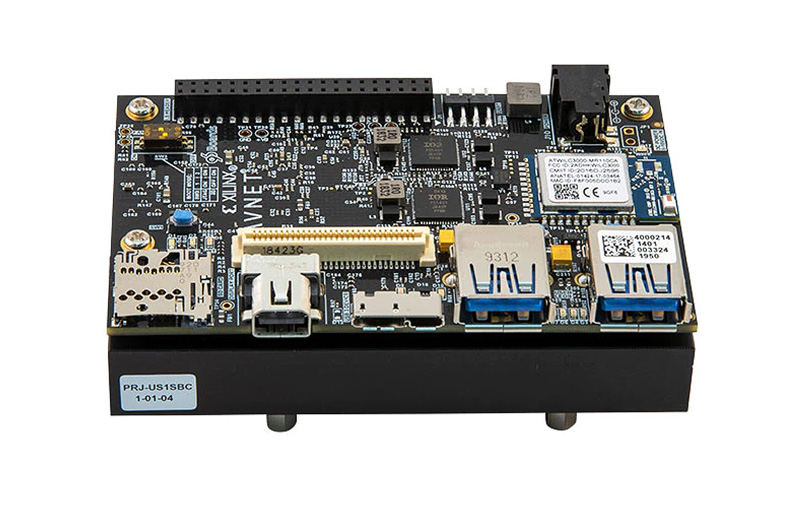

# Tutorial for PYNQ using Ultra96-V2 as an Example

## Overview
This repo provides several tutorials for hardware acceleration using PYNQ on the Ultra96-V2 board.

## Pre-requisites
A Linux machine with:
- Vitis HLS 2023.2
- Vivado 2023.2
- Graphical interface (either you directly run a GUI Linux OS like Ubuntu Desktop, or use a remote desktop solution)
- Access to a PYNQ Ultra96-V2 board

## Background

### Ultra96-V2 Board
The Ultra96-V2 is a low-cost, low-power development board based on the Xilinx Zynq UltraScale+ MPSoC. It features a dual-core ARM Cortex-A53 processor and an FPGA section called programmable logic (PL) that can be used for hardware acceleration.

<i>Ultra96-V2 board. Source: <a herf="https://www.avnet.com/americas/products/avnet-boards/avnet-board-families/ultra96-v2/">avnet.com</a></i>

The board comes with a pre-installed PYNQ OS image, which is based on Linux and includes the necessary drivers and libraries to interact with the hardware. You can remote login to the board with SSH, copy deployment files with SCP, and use Python to run the accelerated applications.

The ARM processor shares the same 2GB memory with the PL, which allows for efficient data transfer between the two. However, there is no protection from the PL side, which means if a bug in the hardware caused it to mess with the memory that the OS is using, the board will crash. You need to reboot the board to recover from this.

Also the 2GB memory is pretty limited if you want to directly code on it with modern IDEs. I highly recommend you finish most of the coding elsewhere and only use the board for testing. If you need to make small on-site tweaks to the code, use some lightweight text editor like vim or nano. **Do not** try to install a full IDE (like VSCode or PyCharm) on the board.

> Also **do not** login to the board with the remote-ssh extension in VSCode. It will install a full-fleged VSCode server on the board, which is too much for its capabilities. Login with a regular terminal instead.

### PYNQ Framework
The <u>Py</u>thon productivipy for ZY<u>NQ</u> (PYNQ) framework allows users to easily invoke the accelerators in the PL with Python. It provides a Python API to program the PL, discover accelerators, and read and write the interface registers of the PL accelerators. For your accelerator to be compatible with PYNQ, it must obey a few interfacing and control rules. In this tutorial, we use Vitis HLS to generate a PYNQ-compatiable accelerator so there is no need to worry about these rules.

On the Ultra96-V2 board we are using, it runs Python 3.6.5 with PYNQ 2.6.0.

## The Tutorial
1. [Quick Start](quickstart/readme.md): A quick start guide to get you familiar development flow.
2. [Command Line Scripting](command_line/readme.md): How to use tcl scripts to automate the development flow.
3. [AXI4-MM 101](AXI4-MM_101/readme.md): A brief introduction to the AXI4 memory-mapped interface.
