# Quickstart Tutorial for PYNQ using Ultra96-V2 as an Example

## Overview
This tutorial provides a starting example for hardware acceleration using PYNQ on the Ultra96-V2 board. It demonstrates how to create a simple hardware vector-vector addition accelerator using Vitis HLS, build a PYNQ overlay for it, and run it on the Ultra96-V2 board.

## Pre-requisites
A Linux machine with:
- Vitis HLS 2023.2
- Vivado 2023.2
- Graphical interface (either you directly run a GUI Linux OS like Ubuntu Desktop, or use a remote desktop solution)
- Access to a PYNQ Ultra96-V2 board

## Background

### Ultra96-V2 Board
The Ultra96-V2 is a low-cost, low-power development board based on the Xilinx Zynq UltraScale+ MPSoC. It features a dual-core ARM Cortex-A53 processor and an FPGA section called programmable logic (PL) that can be used for hardware acceleration.


<div align="center">


<i>Ultra96-V2 board. Source: <a herf="https://www.avnet.com/americas/products/avnet-boards/avnet-board-families/ultra96-v2/">avnet.com</a></i>

</div>

The board comes with a pre-installed PYNQ OS image, which is based on Linux and includes the necessary drivers and libraries to interact with the hardware. You can remote login to the board with SSH, copy deployment files with SCP, and use Python to run the accelerated applications.

The ARM processor shares the same 2GB memory with the PL, which allows for efficient data transfer between the two. However, there is no protection from the PL side, which means if a bug in the hardware caused it to mess with the memory that the OS is using, the board will crash. You need to reboot the board to recover from this.

Also the 2GB memory is pretty limited if you want to directly code on it with modern IDEs. I highly recommend you finish most of the coding elsewhere and only use the board for testing. If you need to make small on-site tweaks to the code, use some lightweight text editor like vim or nano. **Do not** try to install a full IDE (like VSCode or PyCharm) on the board.

> Also **do not** login to the board with the remote-ssh extension in VSCode. It will install a full-fleged VSCode server on the board, which is too much for its capabilities. Login with a regular terminal instead.

### PYNQ Framework
The <u>Py</u>thon productivipy for ZY<u>NQ</u> (PYNQ) framework allows users to easily invoke the accelerators in the PL with Python. It provides a Python API to program the PL, discover accelerators, and read and write the interface registers of the PL accelerators. For your accelerator to be compatible with PYNQ, it must obey a few interfacing and control rules. In this tutorial, we use Vitis HLS to generate a PYNQ-compatiable accelerator so there is no need to worry about these rules.

On the Ultra96-V2 board we are using, it runs Python 3.6.5 with PYNQ 2.6.0.

## The Tutorial

### 1. Setting up the Environment
First, clone this repo:
```bash
git clone
cd ultra96-example
```

We then need to setup the tools to generate the example vector-vector addition accelerator. We need Vitis HLS to trun our C++ code into Verilog, and use Vivado in GUI mode to generate the FPGA bitstream for the Ultra96-V2 board. I have included a `setup.sh` script that will set things up on our research servers. On our servers, simply do:
```bash
source setup.sh
```

Also please check you can reach the Ultra96-V2 board via SSH. Our research servers have network access to them, but from your local machine you must connect to **Cornell ECE Departmental VPN** (it different than the Cornell VPN!).

The username of the board is `xilinx`. Please ask your mentor for the password.
Once the password is set as a environment variable, you can use the following script to check the status of our boards:
```bash
# asssume ULTRA96_PASSWD is set to the correct password
./report-status.sh
```
After a while you should see something like:
```
132.236.59.63: Unable to connect
132.236.59.64: Unable to connect
132.236.59.68: Unable to connect
132.236.59.70: Unable to connect
132.236.59.71: Up and running
132.236.59.72: Unable to connect
132.236.59.75: Up and running
132.236.59.76: Up and running
132.236.59.77: Unable to connect
132.236.59.80: Unable to connect
```
Then you can try to login to the boards that are up and running with `ssh xilinx@<ip>`.

### 2. Use Vitis HLS to Generate the Verilog Code
I have provided the C++ implementation for the vector-vector addition accelerator in `src/vvadd.cpp`. It is a simple function that takes two vectors of floats and adds them together. We will use Vitis HLS to convert this C++ code into Verilog code that can be synthesized into hardware, with the following steps:
```bash
cd src
vitis_hls -f hls.tcl
```
You will see Vitis HLS outputing information to the terminal. When there are no errors, a directory named `build_hls` will be created under `src`. Vitis HLS packges our RTL into an IP core located at `src/build_hls/solution1/impl/ip`, which we will import into Vivado soon.

Although this tutorial is not about HLS, it's still recommended to check the synthesis report to see if the design meets your timing and resource requirements. You can find the synthesis report in `src/build_hls/solution1/syn/report` directory. The report is named `vvadd_csynth.rpt`.

> Notice the `#pragma HLS INTERFACE` directives in the C++ code. They are how we tell Vitis HLS to generate a PYNQ-compatible accelerator. Details are out of the scope of this tutorial, but you can check the [Vitis HLS User Guide](https://docs.amd.com/r/2023.2-English/ug1399-vitis-hls/pragma-HLS-interface) for more information.

### 3. Use Vivado to Build the PYNQ Hardware Overlay

> I recommend you regularly save your project in Vivado, which will minimize the loss of unexpected crashes.

#### 3.1 Create a Vivado Project
Now we will be using Vivado in GUI mode. I recommend you also make a build directory for Vivado by:
```bash
mkdir build_vivado
cd build_vivado
```
You may connect to our servers with any Microsoft Remote Desktop client. If you are using Windows, you can use the built-in Remote Desktop Connection app. If you are using MacOS, you can use the Microsoft Remote Desktop app from the App Store. In your remote desktop session, open a terminal and do setp 1 to setup the environment. Then under the `build_vivado` directory we just created, run:
```bash
vivado
```
to open the Vivado GUI. You should see a window like this:

<div align="center">
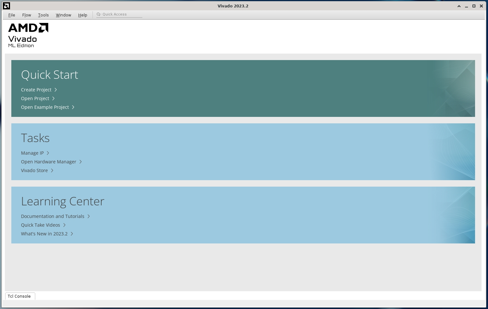
</div>

Click "Create Project", then "Next > Next > Next > Next > Next" until is asks you to select the FPGA part number:
<div align="center">

</div>

Search for `xczu3eg-sbva484-1-i`, select it and click "Next > Finish". A project named `project_1` will be created under the `build_vivado` directory. Now you should see the project window:
<div align="center">
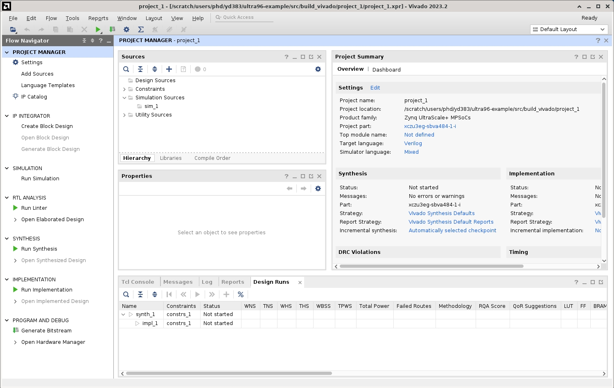
</div>

#### 3.2 Import the HLS IP Core

Now we need to import the IP core we generated with Vitis HLS. Click "IP Catalog" on the "PROJECT MANAGER" on the left, a new tab named "IP Catalog" will be opened on the right. Right click anywhere in the "IP Catalog" tab and select "Add Repository...":
<div align="center">

</div>

Navigate to `src/build_hls/solution1/impl/ip` in the pop-up window and click "Select". Vivado should say there is 1 repository with 1 IP added to the project:
<div align="center">

</div>
click "OK" to confirm.

#### 3.3 Create a Block Design
Vivado provides block design, an elegant way to glue different IP cores together to quickly bring up a system design. Click "Create Block Design" under the "IP INTEGRATOR" item in the "PROJECT MANAGER" panel on the left, then click "OK" in the pop-up window asking for the name of the block design. We will just stick to the default name for simplicity.

**3.3.1: Add the HLS IP.**
A new tab named "Diagram" will be opened on the right, saying "This design is empty. Press the + button to add IP.":
<div align="center">
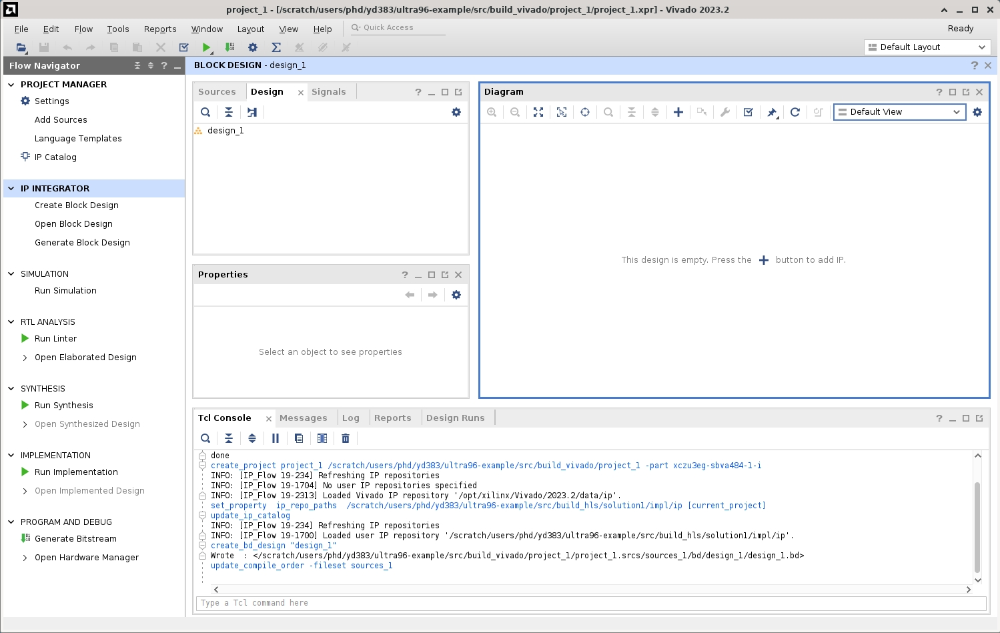
</div>
click the  icon on the top of the "Diagram" tab to add our HLS IP. Our IP is named as "vvadd" so we can search for it:
<div align="center">
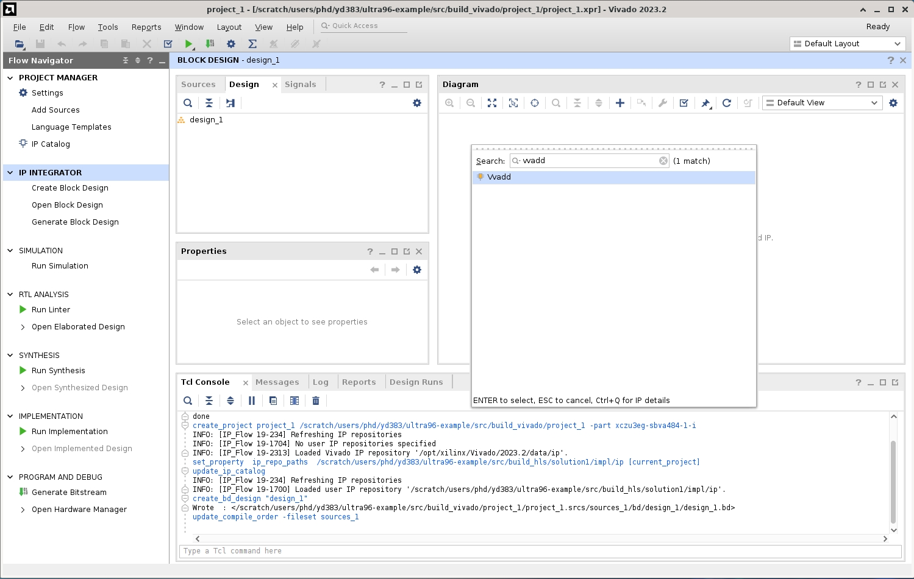
</div>

double-click the found IP to add it to the block design. You should see a block named "vvadd_0" in the diagram:
<div align="center">
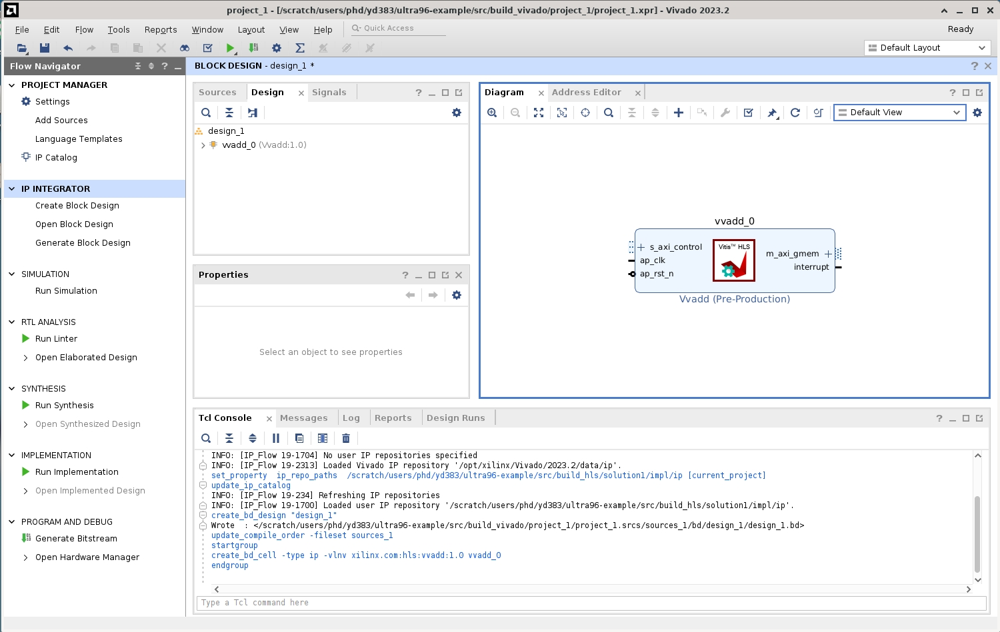
</div>

**3.3.2: Add other IPs.**
Now we need to connect it to the ARM processor. We will do so by creating the following IPs:
- Clocking Wizard (x1)
- Processor System Reset (x1)
- Zynq UltraScale+ MPSoC (x1)
- AXI SmartConnect (x2)

We add these IPs in the same way as we added the HLS IP. Now we should have a block design similar to this:
<div align="center">
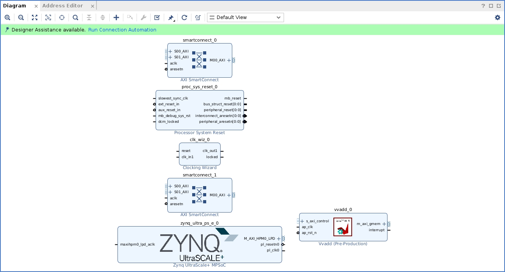
</div>

**3.3.3: Configure IP Parameters.**
The next step is to configure each IP correctly. Double-clicking any IP will open its customization window where we can tweak its parameters.

Let's start with the Clocking Wizard. Double-click the block named "clk_wiz_0", a window named "Re-customize IP" will pop up. In the "Output Clocks" tab, set the requested output frequency to 200MHz and "Reset Type" to "Active Low". This will be the clock driving the accelerator:
<div align="center">
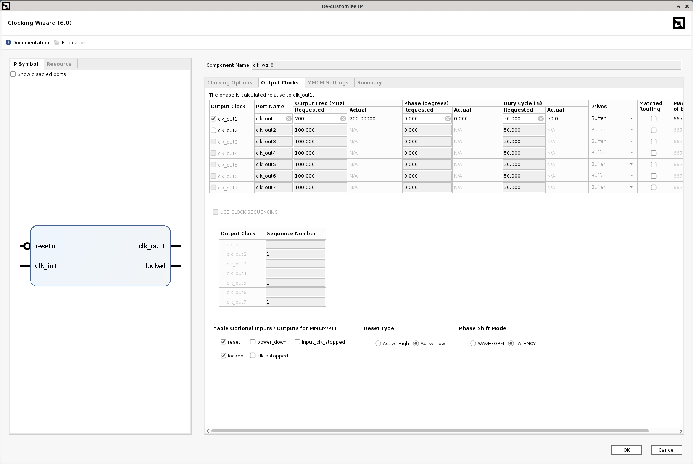
</div>
Click "OK" to confirm.

> Please set this value according to the timing results of your design. An overly high frequency may cause it to crash.

Now the two AXI SmartConnect blocks. We will configure them in the same way. Double-click the first one, named "smartconnect_0", set the "Number of Slave Interfaces" to 1, "Number of Master Interfaces" to 1, "Number of Clock Inputs" to 2, and "Has ARESETN Input" to 1:
<div align="center">
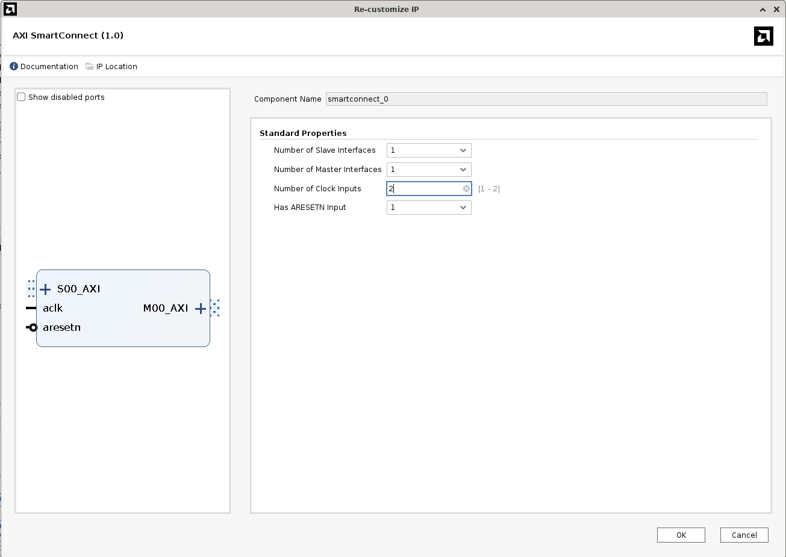
</div>
click "OK" to confirm. Then do the same thing for the second one "smartconnect_1".

Finally we configure the Zynq UltraScale+ MPSoC. Double-click the block named "zynq_ultra_ps_e_0", select "PS-PL Configuration" in the left panel, check the box after "PS-PL Interfaces > Slave Interface > S_AXI_ACP > Use S_AXI_ACP":
<div align="center">
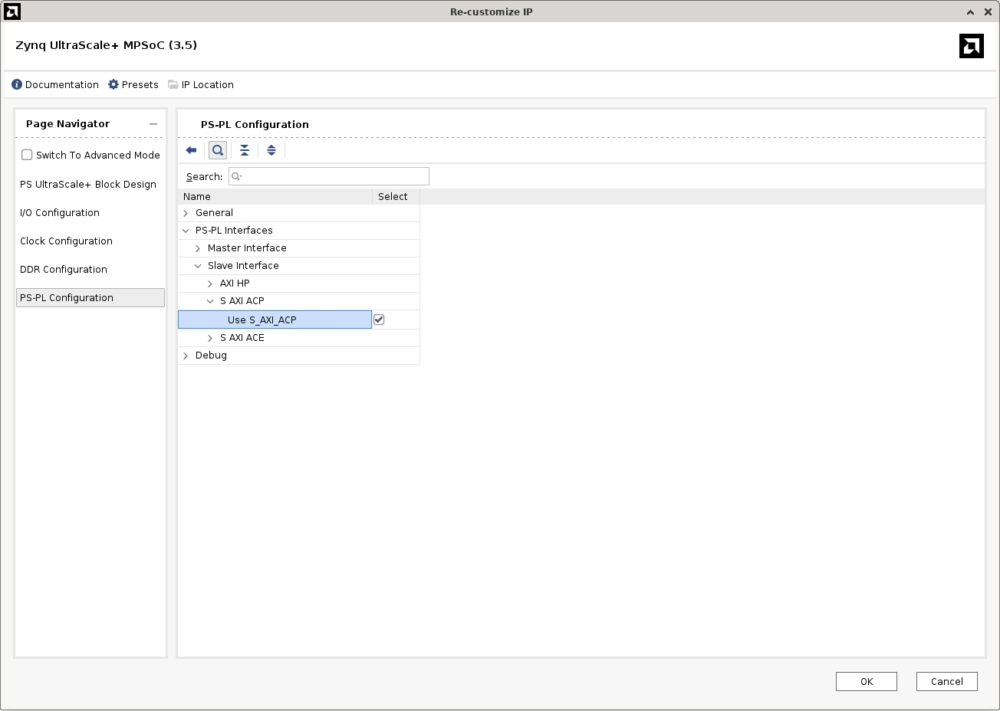
</div>

**3.3.4: Connect the IPs.**
Next we connect those IPs to form a complete system. Click and drag from the `M_AXI_HPM0_LPD` output port of "zynq_ultra_ps_e_0" to connect it to the `S00_AXI` input port of the "smartconnect_0" block; and do the same for the `M00_AXI` output port of "smartconnect_0" to the `s_axi_control` input port of "vvadd_0". The connection should look like this:
<div align="center">

</div>

> You can drag the blocks around to make the diagram look nicer.
> You can also use the "Regenerate Layout" () button to automatically arrange the blocks.

Now do the same for `m_axi_gmem` output port of "vvadd_0" to the `S00_AXI` input port of "smartconnect_1", and `M00_AXI` output port of "smartconnect_1" to the `S_AXI_ACP_FPD` input port of "zynq_ultra_ps_e_0".

Next, connect the `pl_clk0` output of "zynq_ultra_ps_e_0" to the `clk_in1` input of "clk_wiz_0", the `aclk` input of "smartconnect_0", and the `aclk1` input of "smartconnect_1".

Next, connect the `clk_out1` output of "clk_wiz_0" to the `ap_clk` input of "vvadd_0", `slowest_sync_clk` input of "proc_sys_reset_0", `aclk1` input of "smartconnect_0", and `aclk` input of "smartconnect_1".

Next, connect the `peripheral_aresetn` output of "proc_sys_reset_0" to the `ap_rst_n` input of "vvadd_0" and the `aresetn` input of "smartconnect_1".

Next, connect the `pl_resetn0` output of "zynq_ultra_ps_e_0" to the `resetn` input of "clk_wiz_0", `aresetn` input of "smartconnect_0", and `ext_reset_in` input of "proc_sys_reset_0",

Finally, connect the `locked` output of "clk_wiz_0" to the `dcm_locked` input of "proc_sys_reset_0". The rest pins do not need to be connected. You should see a diagram like this:
<div align="center">
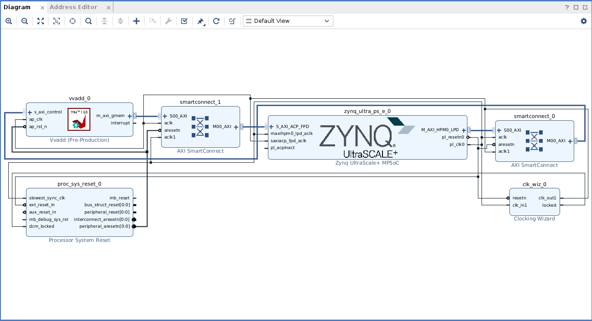
</div>

> Now it's a good time to save the project.

**3.3.5: Give our accelerator access to memory.**
Simply connecting the wires doesn't mean our accelerator can access the memory. We need to assign it an address space using the address editor. Click the "Address Editor" tab on the top next to "Diagram", you will see 3 unassigned address spaces:
<div align="center">
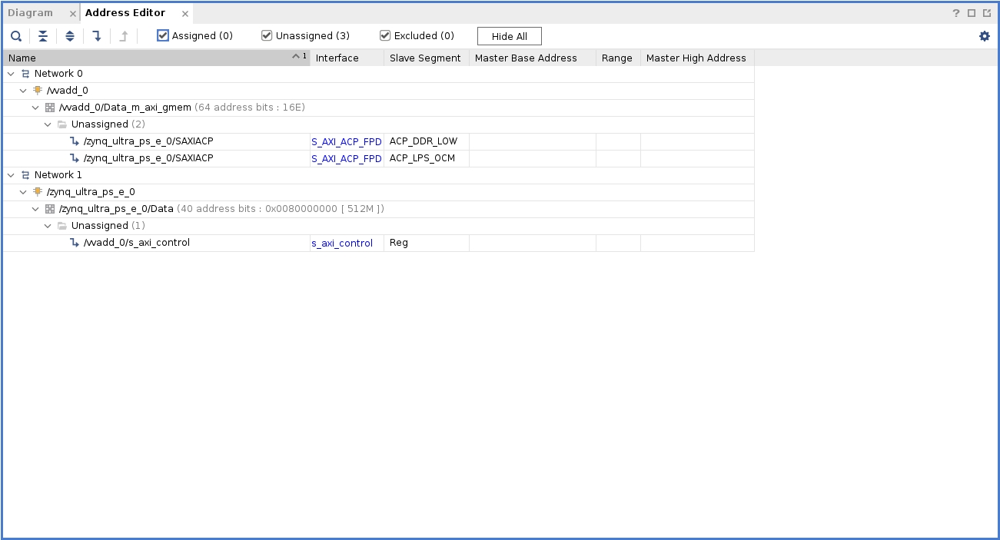
</div>

Right-click and do "Assign All":
<div align="center">

</div>

A pop-up window will inform you that there are no unassigned address spaces any more. You may examine the assigned address spaces:
<div align="center">
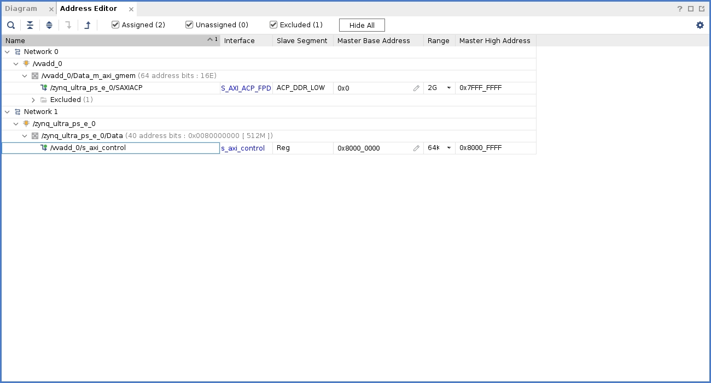
</div>
The first 2GB space is the shard memory between the ARM processor and the PL. The last 64KB space is for the processor to send commands to the accelerator, and for the accelerator to report status back to the processor. The excluded space is because we do not need it and it's disabled in the "zynq_ultra_ps_e_0" IP block.

> Now it's a good time to save the project.

#### 3.4 Generate the Bitstream

Get back to the "Diagram" tab. Click the  button to validate the design. If everything is correct you should see a pop-up window saying "Validation successful. There are no errors or cirtical warnings in the design". Click "OK" to confirm.

A block design cannot be directly synthesized. We need to create a Verilog wrapper for it. In the "Sources" tab on the left of the "Diagram" tab, right-click the block design (design_1.bd) and select "Create HDL Wrapper":
<div align="center">

</div>

In the pop-up window, select "Let Vivado manage wrapper and auto-update" and click "OK". A new file named `design_1_wrapper.v` will be created and selected as the top-level module in the "Sources" tab. The design is now ready for implementation.

> Now it's a good time to save the project.

Click the "Generate Bitstream" button on the left of the Vivado window. A pop-up window will ask you if you want to run synthesis and implementation. Click "Yes" to start the process. Another pop-up window will ask you about some options. We will stick to defaults now. Click "OK" to start the process and wait for it to finish.

> Depending on the scale of the design, it may take minutes to hours. For this simple example it should take around 10 minutes.

When the process is finished, you should see a window saying "Bitstream Generation successfully completed". This time click "Cancel" to close it because we will not be examining the implemented design in this tutorial. The "Design Runs" tab on the bottom will show the timing results of the design:
<div align="center">
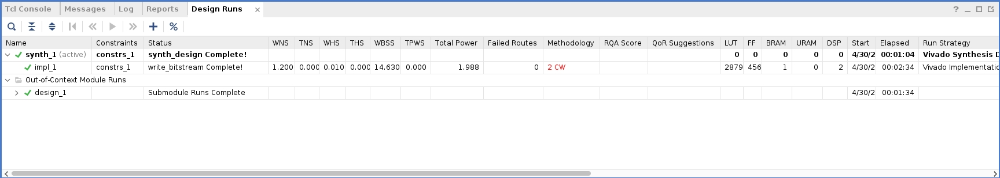
</div>

All slack numbers are positive, our design meets timing! Now we can save the project and close Vivado.

### 4. Deploy Our Design to the Ultra96-V2 Board
Now we collect the necessary files to run our accelerated program on the Ultra96-V2 board. We need:
- The bitstream: `src/build_vivado/project_1/project_1.runs/impl_1/design_1_wrapper.bit`
- The hardware handoff : `src/build_vivado/project_1/project_1.gen/sources_1/bd/design_1/hw_handoff/design_1.hwh`
- The host program: `src/host.py`

Let's collect them into one directory that we will SCP to the board. Note PYNQ requires the bitstream and the hardware handoff to have the same base name and placed together.
```bash
cd src
mkdir -p deploy/vvadd-example
cp build_vivado/project_1/project_1.runs/impl_1/design_1_wrapper.bit deploy/vvadd-example/vvadd.bit
cp build_vivado/project_1/project_1.gen/sources_1/bd/design_1/hw_handoff/design_1.hwh deploy/vvadd-example/vvadd.hwh
cp host.py deploy/vvadd-example/host.py
```
Now we can SCP the deployment files to the Ultra96-V2 board. We will directly place it at the home directory of the `xilinx` user:
```bash
cd deploy
scp -r vvadd-example xilinx@<ip>:~
```
`<ip>` is one of the IP addresses of a running board.

### 5. Run the Program
Once the files are copied, we will SSH to the same board to run the accelerated program:
```bash
# should be the same IP address as above
ssh xilinx@<ip>
```
Then we run the host program:
```bash
cd ~/vvadd-example
sudo python3 host.py
```
> Do not forget to use `sudo` to run the program. The PYNQ framework requires root privileges to access the hardware.

If you see the following output:
```
```

congratulations! You have successfully run your first hardware-accelerated program on the Ultra96-V2 board!
